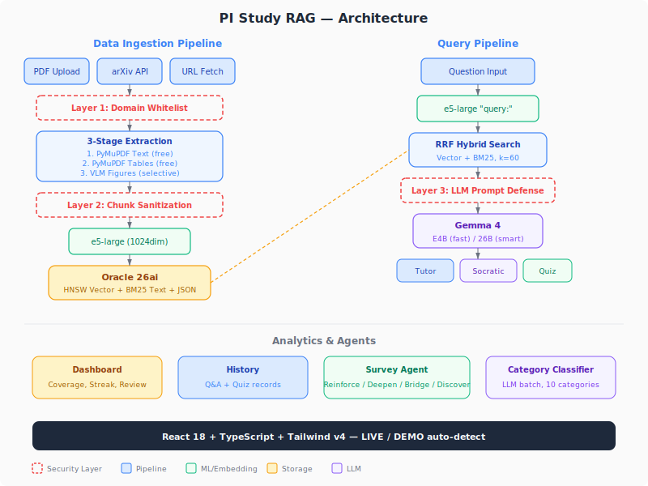

# PI Study RAG

[English version](./README.md)


プロセス・インフォマティクス（PI）研究のための個人用ナレッジベース。
VLM + RAG ハイブリッド検索で学術論文の検索と学習を行えます。

## [▶ ライブデモ (GitHub Pages)](https://seunghwan-dev.github.io/pi-study-rag/)

**DEMO モード** — Docker 不要。フロントエンドはバックエンドの起動状態を自動で検出し、オフライン時はモックデータにフォールバックします。

---

> ⚠️ 個人の学習利用のみを想定しています。本番運用は想定していません。
> すべてのデータソースはオープンアクセス論文および公開資料です。
> 著作権で保護された資料は本リポジトリに含まれていません。

## 機能
- **論文取り込み** — PDF アップロード、または arXiv からの取得。3 段階抽出: PyMuPDF テキスト → テーブル検出 → 選択的 VLM（37 倍高速、コスト $0）
- **RAG Q&A** — ハイブリッド検索（Vector HNSW + BM25 + RRF）と論文引用
- **2 つの学習モード** — Tutor（直接回答）と Socratic（対話で思考を導く）
- **ローカル LLM** — Ollama 経由の Gemma 4 E4B（RTX 4070 SUPER 12GB で動作）
- **クイズモード** — AI が問題生成、回答評価、習熟度追跡
- **サーベイエージェント** — 4 つの戦略（Reinforce / Deepen / Bridge / Discover）で論文を自律的に探索
- **学習ダッシュボード** — カバレッジ、復習ステータス、学習ストリーク
- **3 層セキュリティ** — ドメインホワイトリスト → チャンクサニタイゼーション → LLM プロンプト防御

## アーキテクチャ


## 技術スタック
| コンポーネント | 技術 |
|-----------|-----------|
| VLM | GPT-4o Vision / Gemma 4 Vision（切替可） |
| RAG | Oracle 26ai（Vector HNSW + BM25 + RRF, k=60） |
| LLM | Ollama 経由の Gemma 4 E4B |
| Embedding | multilingual-e5-large（1024 次元） |
| バックエンド | FastAPI (Python)、API エンドポイント 10 個、テスト 32 件 |
| フロントエンド | React 19 + TypeScript + Tailwind CSS v4 |

## クイックスタート
```bash
git clone https://github.com/seunghwan-dev/pi-study-rag.git
cd pi-study-rag
cp .env.example .env
docker compose up -d
docker exec pi-study-rag-ollama-1 ollama pull gemma4:e4b
cd frontend && npm install && npm run dev
```

## デモモード
フロントエンドは Docker なしでも動作します。バックエンドを自動検出し、利用できない場合はモックデータに切り替わります。
```bash
cd frontend && npm install && npm run dev
```

## API エンドポイント (10 個)
| メソッド | パス | 説明 |
|--------|------|-------------|
| POST | /api/v1/study/ingest | PDF アップロード → 3 段階抽出 → Oracle 格納 |
| POST | /api/v1/study/ask | RAG Q&A（Tutor / Socratic モード） |
| POST | /api/v1/study/search-papers | arXiv 論文検索 |
| POST | /api/v1/study/fetch-paper | 自動ダウンロード + 取り込み |
| GET  | /api/v1/study/history | 学習履歴 |
| GET  | /api/v1/study/categories | カテゴリ一覧 |
| GET  | /api/v1/study/progress | カバレッジ + 復習ステータス |
| GET  | /api/v1/study/survey | サーベイエージェント |
| POST | /api/v1/study/quiz/generate | クイズ生成 |
| POST | /api/v1/study/quiz/evaluate | クイズ評価 |

## セキュリティ
1. **ドメインホワイトリスト** — 信頼できる学術ソースのみ許可
2. **チャンクサニタイゼーション** — プロンプトインジェクションパターンをフィルタ
3. **LLM プロンプト防御** — 取得したコンテキストをデータとしてのみ扱うよう明示

## 3 段階抽出パイプライン
| ステージ | 手法 | コスト |
|-------|--------|------|
| テキスト | PyMuPDF | 無料 |
| テーブル | PyMuPDF find_tables() | 無料 |
| 図版 | GPT-4o Vision（選択的） | 約 $0.02/ページ |

改善前: 22 ページ → 1347 秒、$0.50 / 改善後: 22 ページ → 36 秒、$0.00（**37 倍高速**）

## FieldOps-AI からのパイプライン再利用
| 観点 | FieldOps-AI | PI Study RAG |
|--------|-------------|-------------|
| ドメイン | 製造業 | PI 研究 |
| LLM | Qwen 2.5 7B | Gemma 4 E4B |
| 独自機能 | ML+RAG フュージョン | Survey + Quiz + 3 段階抽出 |

同じアーキテクチャ、異なるドメイン。
